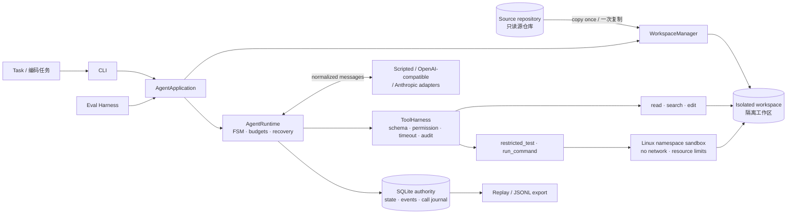

# Production-oriented Coding Agent / 面向工程的 Coding Agent

[](https://github.com/1hm-1/coding-agent/actions/workflows/ci.yml)
[](https://www.python.org/)
[](https://github.com/1hm-1/coding-agent/tree/v0.1.0)
[](LICENSE)

> **固定工程基线 / Stable engineering baseline:**
> [`v0.1.0`](https://github.com/1hm-1/coding-agent/tree/v0.1.0) ·
> [中英双语发布说明 / Bilingual release notes](docs/releases/v0.1.0.md) ·
> [托管 CI / Hosted CI](https://github.com/1hm-1/coding-agent/actions/runs/34039302700)

一个强调**确定性、可恢复性、可审计性和隔离边界**的单 Agent 编码运行时。项目用真实执行证据
证明完整的 `model → tool → observation → recovery` 闭环，而不是用工具数量包装聊天接口。

A single-agent coding runtime focused on **determinism, recovery, auditability, and isolation
boundaries**. It demonstrates a complete `model → tool → observation → recovery` loop with
executable evidence instead of presenting a large tool list around a chat interface.

当前基线完成 M1—M4、Release/Evidence Hardening、由真实 Eval 失败覆盖批准的 M5.1
只读搜索，以及 Phase 2 P2-M1 Headless Runtime IPC 与 P2-M2 Layered Memory。
P2-M2 的 Memory 仅通过显式 Python composition 使用；默认 `AgentApplication`/headless
配置不会自动查询或注入 Memory。P2-M3 Skill/Profile、MCP、多 Agent 仍未激活。

The current baseline completes M1—M4, Release/Evidence Hardening, M5.1 read-only search approved
by live Eval failure coverage, and Phase 2 P2-M1 Headless Runtime IPC plus P2-M2 Layered Memory.
P2-M2 Memory is available only through explicit Python composition; the default
`AgentApplication`/headless configuration does not automatically query or inject Memory.
P2-M3 Skills/Profiles, MCP, and multi-agent orchestration remain inactive.

## 验证结果 / Evidence at a glance

| 固定发布证据 / Pinned v0.1.0 evidence | 结果 / Result |
|---|---:|
| 默认测试 / Default tests | **93/93 passed** |
| 语义 golden trajectories | **4/4 passed** |
| Statement coverage | **75.6%** (70% gate) |
| 静态与构建门禁 / Static and build gates | Ruff, mypy, compileall, wheel/sdist passed |
| 固定离线 Eval / Fixed offline Eval | **10/10** normal tasks; **4/4** negative controls observed |
| 三仓库 search live follow-up | **14/15** end-to-end |
| 非 search DeepSeek holdout | **12/12** end-to-end |
| 源仓库不变 / Source repository unchanged | **100%** in recorded Eval runs |
| 托管 CI / Hosted CI | Python **3.10 + 3.11** passed |

上表只描述固定的 `v0.1.0`；当前开发树的 P2-M2 验收结果和限制见
[`docs/current-state.md`](docs/current-state.md) 与
[`p2-m2-implementation-plan.md`](docs/p2-m2-implementation-plan.md)。

这些结果来自版本化的小型 fixture、离线 oracle 和独立真实 Provider 请求，只是可复核的工程
证据，不代表通用编码任务或生产成功率。脱敏报告位于 [`docs/evidence`](docs/evidence/)。

These results come from versioned small fixtures, offline oracles, and independent live Provider
requests. They are auditable engineering evidence, not a general coding-task or production
success-rate claim. Sanitized reports are stored in [`docs/evidence`](docs/evidence/).

## 架构 / Architecture



关键约束 / Key invariants:

- Runtime 的状态变化只发生在 FSM；Provider 格式只存在于 adapter。<br>
  Runtime state changes stay inside the FSM; Provider-specific formats stay inside adapters.
- 所有副作用都经过 ToolHarness，任务只修改隔离 workspace。<br>
  Every side effect passes through ToolHarness, and tasks modify only the isolated workspace.
- SQLite 是 session 恢复的唯一权威，JSONL 是可删除、可重建的导出。<br>
  SQLite is the sole recovery authority; JSONL is a disposable, rebuildable export.
- 不提供通用 Shell；执行能力只接受可信 profile 与结构化 argv。<br>
  There is no general Shell; execution accepts only trusted profiles and structured argv.

详细设计见 [架构文档 / architecture](docs/architecture.md)、
[模块边界 / module design](docs/module-design.md) 和
[运行契约 / contracts](docs/contracts.md)。

## 快速开始 / Quick start

### 1. 安装固定版本 / Install the pinned release

```bash
git clone https://github.com/1hm-1/coding-agent.git
cd coding-agent
git checkout v0.1.0
uv venv --python 3.11 .venv
uv sync --locked --extra dev
```

Python 3.10 和 3.11 是发布验证版本。完整固定复现命令见
[v0.1.0 发布说明 / release notes](docs/releases/v0.1.0.md)。

Python 3.10 and 3.11 are the validated release targets. See the
[v0.1.0 release notes](docs/releases/v0.1.0.md) for the complete pinned reproduction commands.

### 2. 运行确定性 Demo / Run the deterministic demo

当前开发树同时提供 capability discovery 和严格的 `run-headless` producer：

```bash
PYTHONPATH=src python3 -m coding_agent.cli \
  protocol-info --protocol-version 1 --output json

# request 必须位于私有 attempt/input 目录、权限至多 0600，并符合权威 Schema
PYTHONPATH=src python3 -m coding_agent.cli \
  run-headless --protocol-version 1 \
  --request-file /private/attempt/input/request.json
```

需要原生 Linux namespace 能力；能力不足时 sandbox 会 fail closed。

Native Linux namespace support is required; the sandbox fails closed when unavailable.

```bash
demo_home="$(mktemp -d /tmp/coding-agent-demo.XXXXXX)"
PYTHONPATH=src .venv/bin/python -m coding_agent.cli \
  --agent-home "$demo_home" run-scripted \
  --source examples/todo_cli \
  --task "Fix the empty input crash and run tests." \
  --script examples/todo_cli_scripted_run.json
```

该 Demo 故意保留一次失败修复，并根据 observation 二次修正：

The demo intentionally preserves an incorrect first fix and then recovers from the observation:

| 轨迹 / Trajectory | 结果 / Result |
|---|---:|
| Runtime state | `COMPLETED` |
| Model / tool calls | `6 / 5` |
| Tool order | `read → edit → test → edit → test` |
| Test outcomes | `false → true` |
| Replay events | `72` continuous events |
| Original fixture | unchanged |
| Isolated workspace | `todo_parser.py` modified |

复制输出中的 `session_id` 进行回放，并验证源 fixture 未改变：

Copy the returned `session_id` to replay the run and verify that the source fixture is unchanged:

```bash
PYTHONPATH=src .venv/bin/python -m coding_agent.cli \
  --agent-home "$demo_home" replay --session-id <session-id>

git diff --exit-code -- examples/todo_cli
```

### 3. 运行发布门禁 / Run the release gates

```bash
PYTHONWARNINGS=error PYTHONPATH=src .venv/bin/python -X dev -m unittest discover -v
.venv/bin/ruff check src tests examples/todo_cli examples/mini_repos examples/memory_cold_warm_benchmark.py
.venv/bin/mypy
PYTHONPATH=src .venv/bin/python -m compileall -q src tests examples/todo_cli examples/mini_repos examples/memory_cold_warm_benchmark.py
PYTHONPATH=src .venv/bin/python examples/memory_cold_warm_benchmark.py
```

### 4. 运行固定离线 Eval / Run the fixed offline Eval

```bash
eval_root="$(mktemp -d /tmp/coding-agent-eval.XXXXXX)"
PYTHONPATH=src .venv/bin/python -m coding_agent.cli \
  --agent-home "$eval_root/agent-home" \
  evaluate --suite examples/eval_suite.json \
  --variant budgeted --repetitions 1 \
  --output "$eval_root/report"
```

预期结果是 14/14 valid runs、10/10 正常任务端到端成功、4/4 负控制命中、0 基础设施失败，
且 source invariant rate 为 1.0。

Expected: 14/14 valid runs, 10/10 normal tasks end-to-end, 4/4 negative controls observed,
zero infrastructure failures, and a source invariant rate of 1.0.

### 5. 运行 P2-M2 Memory cold/warm benchmark

```bash
PYTHONPATH=src .venv/bin/python examples/memory_cold_warm_benchmark.py
```

该 benchmark 使用 12 个冻结 case 和可信 oracle，在共享 cold 结果上运行旧检索/JSON Context 与
加权检索/紧凑 Context 的 before/after A/B，并比较默认 context 与显式 Memory composition，
覆盖明确相关、无匹配、词面相似但语义无关、错误 user scope、错误 repository/revision、
stale/deleted 以及诱导指令拒绝。它报告 task success、relevant recall、precision/irrelevant
injection、无关 Memory 导致的行为变化、scripted model Token、retrieval Token、Memory context
Token、Token per successful task 和端到端延迟。它不代表真实 Provider 收益，也不会修改仓库
source fixture。

## 核心能力 / Core capabilities

| 模块 / Area | 已实现 / Implemented |
|---|---|
| Runtime | 显式 FSM；step/model/tool budgets；结构化失败；安全中断与恢复 / Explicit FSM, budgets, classified failures, safe interruption and recovery |
| Tools | `read_file`, `search_files`, `edit_file`, `restricted_test`, `run_command` |
| Persistence | SQLite schema v4；原子 Runtime journal + Memory record/lifecycle/retrieval audit / SQLite v4, atomic Runtime journal and Memory audit |
| Context | 分区预算、hard retention、原子 tool-call 组裁剪、带 lineage 的压缩 / Section budgets, hard retention, atomic tool-call groups, lineage-aware compression |
| Memory | 受控 episodic/semantic proposal/approval/stale/delete；有界 lexical retrieval；scope/revision/provenance 隔离；仅显式 Python composition / Governed lifecycle, bounded lexical retrieval, scoped provenance; explicit Python composition only |
| Sandbox | Rootless Linux namespaces、只读 rootfs、默认禁网、资源限制、进程清理 / Rootless namespaces, read-only rootfs, no network, limits, cleanup |
| Evaluation | 版本化 suite、可信 oracle、正常任务/负控制分离、paired A/B、Provider override / Versioned suites, trusted oracles, separated controls, paired A/B, Provider override |
| Models | Deterministic ScriptedBackend, OpenAI-compatible, Anthropic, retry/backoff, explicit fallback |
| Audit | SQLite replay、可重建 JSONL、语义 golden、source invariant / SQLite replay, rebuildable JSONL, semantic goldens, source invariant |

## 真实模型 / Live Providers

默认测试完全离线。真实 Provider 只能显式启用，API key 从环境变量读取，不会写入 SQLite、
trajectory 或错误文本。DeepSeek 通过 OpenAI-compatible adapter 使用，并必须关闭 thinking，
因为当前 Runtime 不回传 `reasoning_content`。

Default tests are fully offline. Live Providers are opt-in; API keys are read from environment
variables and are not persisted to SQLite, trajectories, or error text. DeepSeek uses the
OpenAI-compatible adapter with thinking disabled because the current Runtime does not round-trip
`reasoning_content`.

```bash
export OPENAI_API_KEY='<provider-key>'

PYTHONPATH=src .venv/bin/python -m coding_agent.cli \
  --agent-home /tmp/coding-agent-provider-demo \
  run --provider openai-compatible --model <model> \
  --base-url https://api.deepseek.com --thinking disabled \
  --source examples/fixture --task "Fix add and run tests"
```

真实 Provider 的脱敏 smoke 与 Eval 证据见
[`docs/evidence`](docs/evidence/) 和
[M5 Eval 记录](docs/m5-eval-expansion.md)。
简历稳定性与上下文压缩实验的冻结口径及 live 结果见
[Resume benchmark](docs/resume-benchmark.md)：`deepseek-flash` 稳定性为 24/25；压缩 A/B
没有节省 Token，且只作为小型本地 benchmark 解读。

Sanitized live smoke and Eval evidence is available under
[`docs/evidence`](docs/evidence/) and in the
[M5 Eval record](docs/m5-eval-expansion.md).
The frozen resume-stability and context-compression protocol and live result are in the
[resume benchmark](docs/resume-benchmark.md): `deepseek-flash` reached 24/25 stability runs, while
the compression A/B did not save tokens and remains a small local benchmark.

## 支持边界 / Supported boundaries

支持 / Supported:

- CPython 3.10/3.11 与 Linux/POSIX 进程语义。<br>
  CPython 3.10/3.11 and Linux/POSIX process semantics.
- 确定性和显式启用的真实模型后端、单 Agent session、恢复、回放与小型 Eval。<br>
  Deterministic and opt-in live backends, single-agent sessions, recovery, replay, and small Eval suites.
- 仅在 capability probe 成功时使用原生 Linux namespace sandbox。<br>
  Native Linux namespace sandbox only when its capability probe succeeds.

明确不支持 / Explicitly unsupported:

- 生产级强多租户隔离、OCI image lifecycle、SBOM 或漏洞扫描。<br>
  Production-grade strong multi-tenant isolation, OCI image lifecycle, SBOM, or vulnerability scanning.
- 通用 Shell、任意 executable、默认网络或模型驱动依赖安装。<br>
  General Shell, arbitrary executables, default network, or model-directed dependency installation.
- Git inspection 工具、多 Agent、UI、RAG、Skills、procedural memory，以及默认入口的自动 Memory
  注入；Memory CLI/UI 也未实现。<br>
  Git inspection tools, multi-agent orchestration, UI, RAG, Skills, procedural memory, automatic
  Memory injection in default entrypoints, or a Memory CLI/UI.
- Windows/macOS 等价 sandbox 保证或通用生产成功率声明。<br>
  Windows/macOS-equivalent sandbox guarantees or a general production success-rate claim.

## 文档导航 / Documentation

| 文档 / Document | 用途 / Purpose |
|---|---|
| [当前实现 / Current state](docs/current-state.md) | 已实现行为、限制与技术债 / Implemented behavior, limits, and debt |
| [开发交接 / Handoff](docs/HANDOFF.md) | 新开发窗口的唯一入口 / Entry point for a new development session |
| [架构 / Architecture](docs/architecture.md) | 目标架构与安全边界 / Target architecture and security boundaries |
| [开发指南 / Development guide](docs/development-guide.md) | 安装、命令与变更流程 / Setup, commands, and change workflow |
| [测试策略 / Testing strategy](docs/testing-strategy.md) | 测试层次、golden 与 CI / Test layers, goldens, and CI |
| [路线图 / Roadmap](docs/roadmap.md) | 证据门控的里程碑 / Evidence-gated milestones |
| [M5.1 决策 / M5.1 decision](docs/decisions/m5-1-search-files.md) | 为什么增加最小只读搜索 / Why minimal read-only search was added |
| [v0.1.0 发布说明 / Release notes](docs/releases/v0.1.0.md) | 固定复现步骤与完整边界 / Pinned reproduction and full boundaries |
| [Phase 2 实施计划 / Implementation plan](docs/p2-implementation-plan.md) | 已完成 P2-M1 checklist 与后续路线 / Completed P2-M1 checklist and staged roadmap |
| [P2-M2 Memory 计划 / P2-M2 Memory plan](docs/p2-m2-implementation-plan.md) | Memory 契约、benchmark 与退出证据 / Memory contract, benchmark, and exit evidence |
| [Memory 检索优化 / Retrieval optimization](docs/p2-m2-retrieval-optimization.md) | 冻结 A/B、检索精度与 Token 证据 / Frozen A/B, retrieval precision, and token evidence |
| [Phase 2 产品架构 / Product architecture](docs/v2-product-architecture.md) | 已实现 Memory 与未来 Skill/MCP、多 Agent、终端边界 / Implemented Memory and staged future capabilities |
| [Runtime IPC v1](docs/protocol/runtime-ipc-v1.md) | 已实现的 producer 进程契约；Platform consumer 仍外置 / Implemented producer contract; Platform consumer remains external |

新接手开发请先阅读 `AGENTS.md`、[HANDOFF](docs/HANDOFF.md) 和
[current-state](docs/current-state.md)。不要根据目标架构假设能力已经实现。

New contributors should begin with `AGENTS.md`, the [handoff](docs/HANDOFF.md), and the
[current state](docs/current-state.md). Do not infer implemented capabilities from the target
architecture alone.

## License / 许可证

[MIT](LICENSE)
