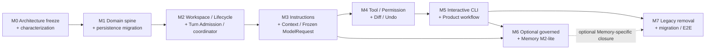

# Coding Agent V1 Product-Layer Implementation Roadmap

Date: 2026-09-23
Status: **Architecture frozen; Product-Layer M0–M2 Accepted/complete; M3–M7 inactive; M3 not issued**

## Purpose

This roadmap implements the accepted Coding Agent product ADRs incrementally around the existing
RuntimeExecution kernel. It replaces the future-work ordering in the superseded
[`conversation-runtime-refactor-plan.md`](./conversation-runtime-refactor-plan.md) and the
coordinator/terminal ordering in the older Phase 2 architecture. It does not erase the historical
delivery record in [`roadmap.md`](./roadmap.md).

The milestone names M0–M7 in this document are scoped to the Product-Layer migration and are not
the historical Runtime M0–M5 milestones.

The user explicitly activated Product-Layer M0 for architecture freeze and characterization and
accepted it as complete on 2026-09-21. The formal
[`M1 execution contract`](./execution-contracts/m1-execution-contract.md) was issued and completed
on 2026-09-22. The formal [`M2 execution contract`](./execution-contracts/m2-execution-contract.md)
was accepted and completed on 2026-09-23. M3–M7 remain inactive, and M3 has not been issued. M1 implements its additive domain/persistence scope;
the physical choices are recorded in [`m1-product-persistence-design.md`](./m1-product-persistence-design.md).
No target product behavior from M2–M7 was implemented by M0 or M1. This Product-Layer M0 must not be confused with the completed historical Runtime M0 milestone in
[`roadmap.md`](./roadmap.md).

## Implementation principles

1. Preserve the deterministic RuntimeExecution kernel; add Product-layer identity and use cases
   around it.
2. SQLite remains the single durable authority. Additive compatibility records are not a second
   store.
3. Prefer additive migrations, adapters, and versioned projections over destructive renames.
4. Keep existing one-shot, eval, headless IPC, JSONL export, replay, and semantic goldens working
   until their replacement paths have equivalent success, failure, and recovery evidence.
5. Do not enable direct-working-tree behavior merely by changing a path. WorkspaceBinding,
   checkpoint, writer, drift, permission, and recovery rules must arrive together.
6. Do not expose an interactive command before its durable use case exists.
7. Do not make optional Memory a prerequisite for Conversation, Context, CLI, or recovery.
8. No milestone may bypass ToolHarness or move Runtime FSM decisions into the coordinator.

## Dependency DAG



The V1 critical path is:

```text
M0 → M1 → M2 → M3 → M4 → M5 → M7
```

M6 is optional. M7 core compatibility, migration, and end-to-end closure may begin after M5 without
waiting for M6. If M6 is activated, its Memory-specific migration and tests feed the corresponding
optional M7 closure lane.

## Compatibility seams kept throughout migration

| Existing surface | Compatibility rule |
|---|---|
| `Session` class and `sessions` table | treat as legacy RuntimeExecution representation until new product mappings are proven; no early destructive rename |
| `AgentApplication.run_task()` | retain as one-shot compatibility use case, initially wrapped by a synthetic one-Turn product mapping |
| `resume_session()` and current CLI `resume` | retain as explicit legacy execution-resume/admin path while product `/resume` gains Conversation semantics |
| copied per-session workspace | retain for eval, headless IPC v1, release compatibility, and tests; do not use as new interactive default |
| Runtime IPC v1 `runtime_session_id` and read-only source | preserve wire compatibility; internal mapping may point to RuntimeExecution |
| SQLite v4 data | every migration reads it and rolls back atomically on failure |
| messages/events/checkpoints/model_calls/tool_calls/summaries | preserve as Runtime/audit input until Product-layer ownership is migrated and verified |
| JSONL export/replay | continue to derive from SQLite; version projections rather than deleting old readers prematurely |
| four semantic goldens | preserve or version explicitly with both old and new projections during migration |
| current Memory tables and evidence | keep dormant and opt-in; do not wire into the critical path |

## Frozen V1 delivery envelope

The release target is a **Linux local single-user, preprovisioned pure-Python/package development
vertical slice using POSIX process semantics** on sandbox features that are present and enforceable.
It does not promise macOS or Windows support, native compiler/toolchain provisioning, or dependency
bootstrap.
Bounded filesystem operations and read-only Git inspection remain language-agnostic.
Python is the V1-certified command ecosystem and delivery scope, not a limitation of the domain
architecture. The accepted capability model remains ecosystem-agnostic: future language or tooling
profiles can be added without redesigning the domain model, but they require separate activation,
enforceable trust/policy configuration, and acceptance evidence and are never automatically
authorized by this roadmap.

[`v1-development-capability-matrix.md`](./v1-development-capability-matrix.md) freezes the required
filesystem, Git inspection, Python test/lint/typecheck/build, structured-command, permission, and
hard-boundary acceptance scope. The matrix is a target commitment, not current implementation
status. M4 must implement and verify it; M7 must publish and evaluate the resulting support matrix.

Explicit V1 non-goals are:

- background or long-running process management as a durable product resource; bounded foreground
  tools may run for a long time but remain supervised;
- Conversation rewind;
- joint code-and-Conversation rewind;
- unrestricted arbitrary shell; and
- automatic support or provisioning for Node/npm, Rust/Cargo, Go, Java, native toolchains, or
  other package ecosystems.

The accepted command ADR's explicit shell-program form remains a possible future capability. It is
`UNAVAILABLE` in V1, not removed from the domain model.

## Acceptance measurement contract

M0 freezes the versioned measurement contract below before implementation comparisons begin. Every
metric records the applicable existing identities from `Conversation`, `Turn`, `RuntimeExecution`,
`ModelRequest`, model attempt, `ToolInvocation`, and tool attempt; aggregate rows trace to their
source identity set. Legacy M0 samples retain their Session mapping/legacy label rather than
fabricating future Product IDs. Local queries and CodeRewindOperation do not acquire a Turn,
RuntimeExecution, or ModelRequest for telemetry. Summary/compaction provider calls remain separate
auxiliary request lineages and are never silently charged to an Agent ModelRequest.

Every numeric usage or timing value is labeled `measured`, `estimated`, or `unknown`. Missing
provider usage is `unknown`, never measured zero. A total containing unknown components is reported
as incomplete/unknown coverage, not as an exact complete total. Failed, retried, denied, timed-out,
and cancelled attempts remain in their populations rather than disappearing behind successful
terminal runs.

| Metric | Unit and formula/population | Required source and classification |
|---|---|---|
| End-to-end elapsed | milliseconds from durable request acceptance through terminal Turn outcome; all waits included | process-local monotonic segments plus durable wall-clock anchors; classification reflects cross-restart anchor coverage and uncertainty |
| Model-attempt latency | milliseconds per every started provider attempt, including failure/retry/cancel/unknown outcome | adapter attempt start/end evidence; missing end is censored/unknown, not omitted |
| Tool-attempt latency | milliseconds per every admitted execution attempt, including nonzero/timeout/crash/cancel outcomes | ToolHarness/sandbox attempt boundaries; permission-denied requests are not executions |
| Machine-active time | milliseconds in the union of attributable model, tool, and local compute spans; recovery compute may be included with a recovery label, but permission/user wait, retry backoff, and host downtime are excluded | versioned span rules; overlapping spans use interval union and are not double-counted |
| Permission wait | milliseconds from durable PermissionRequest to matching decision/cancel/terminal resolution | durable permission records; separate from machine execution |
| Other user wait | milliseconds for clarification/reply and other typed user waits | durable request/reply records; separate from permission wait and machine execution |
| Retry/recovery overhead | milliseconds and counts for retry backoff, restart, reconciliation, and replay/reuse | attempt and recovery journal; reported separately even when included in end-to-end elapsed |
| Token usage | input/output/cache units per model or compaction attempt, including failures and retries | provider-reported usage is `measured`; versioned tokenizer/local attribution is `estimated`; absent/unsupported is `unknown` |
| Cost | currency computed from classified usage multiplied by a versioned model/rate assumption effective for the report | `estimated`/derived even when usage is measured; usage provenance remains separate. Only independent invoice/billing reconciliation may label cost `measured` |
| Permission outcome | request/ALLOW/ASK/DENY/UNAVAILABLE counts and wait distributions | policy/request/decision journal; denial is not an executed unauthorized side effect |
| Safety violation | count of proven effects that crossed a denied or hard boundary | effect/audit evidence; kept distinct from denials, unavailable requests, invalid calls, and negative-control success |
| Task quality | oracle success and end-to-end success over normal capability tasks | frozen trusted oracles; Runtime completion remains separate |
| Negative/invalid outcome | observed expected safety-negative behavior and infrastructure-invalid runs | separate populations and denominators; never mixed into normal capability success |

End-to-end elapsed is not the sum of displayed subspans. Permission wait, other user wait,
machine-active intervals, retry backoff, recovery compute/wait, and host downtime can overlap or
nest; the report gives both the wall-clock metric and interval-union/accounting coverage. Recovery
reports machine-execution spans separately from reconciliation/user wait. A process-local monotonic
clock is never subtracted across crash/restart: each host segment is measured independently and
linked with durable wall-clock anchors plus uncertainty. Missing cross-segment intervals are
`estimated` or `unknown`. Denied operations count as policy outcomes, not tool executions or
permission violations, unless independent evidence proves an unauthorized effect.

The current evaluator is a characterization input, not already compliant evidence: it records
model latency only for `MODEL_CALL_SUCCEEDED`, adapters can encode absent usage as zero, and the
legacy `permission_violations` field counts denials. M0 must version and preserve those limitations,
must not reinterpret historical zeros as measured usage or denials as side effects, and must add a
new projection rather than rewrite old evidence.

M0 also freezes two separate evidence lanes:

1. an offline deterministic baseline reproducible without provider credentials; and
2. credential-gated real-provider runs with explicit model/rate/configuration provenance.

No new paid/live run is authorized by this roadmap patch. The baseline manifest fixes immutable
repository revisions, exact task text, oracle, configuration, model or scripted backend, seed where
supported, budgets, machine/OS/load assumptions, sandbox capability snapshot, sample sizes, and
artifact hashes. It distinguishes inherited historical evidence from the new baseline. Fixture-only
correctness is not evidence of real-repository capability, and current headless copied-workspace
tasks must not be falsely paired with future interactive direct-tree tasks; unimplemented arms are
reported as gaps until like-for-like evidence exists.

### Observability ownership

| Milestone | Required observability deliverable |
|---|---|
| M0 | metric definitions, source/classification rules, current limitations, reproducible current baseline, representative real-repository task manifest, environment and sample-size freeze |
| M3 | model attempts, Context/compaction operations, token attribution, unknown-usage coverage, and auxiliary-request lineage |
| M4 | tool latency/failure/retry, permission outcomes and wait, sandbox admission, command observations, reconciliation, and recovery overhead |
| M5 | input/control responsiveness, received-versus-applied input state, local progress, and per-Turn execution/usage/cost summary |
| M7 | controlled paired evaluation, raw manifests/artifact hashes, complete failure accounting, and release evidence |

## M0 — Architecture freeze and characterization

Formal milestone execution contract: [`execution-contracts/m0-execution-contract.md`](./execution-contracts/m0-execution-contract.md).

**Historical activation boundary (closed):** M0 was ACTIVE for characterization only. The user
authorized a narrowly scoped, behavior-preserving testability change only when characterization
genuinely required it. Each such change had to record why it was necessary, why a fixture/harness
or other non-production-code alternative was insufficient, the before/after semantic-equivalence
argument, and the tests that proved that equivalence. This exception did not authorize M1
production entities, domain classes, tables, migrations, or public schemas; fix or redefine
product/Runtime semantics; add production metrics instrumentation; change defaults or public
protocols; or serve as a backdoor into any M1–M7 deliverable. The exception ended when M0 was
accepted.

### Scope

- Freeze the eight accepted ADRs, consistency audit, target snapshot, identity glossary, and this
  dependency DAG as the implementation input.
- Characterize current one-shot Session creation, isolated workspace preparation, context build,
  model/tool journal, retry, interrupt, direct execution resume, lease, reconciliation, JSONL
  export, Runtime IPC v1, Memory-off default, and eval behavior.
- Create expected-gap fixtures for two-turn Conversation continuity, direct working-tree binding,
  ephemeral startup, product `/resume`, typed permission, frozen uncertain retry, and controlled
  undo without implementing them.
- Record the exact current SQLite schema/version, event/golden versions, public CLI, IPC schemas,
  and supported migration starting points.
- Freeze the acceptance measurement contract, representative real-repository task set, immutable
  revisions, exact task/oracle/configuration manifests, machine/load/sample assumptions, and the
  provenance boundary between old evidence and a new baseline.
- Characterize current measurement limitations, including success-only model latency, absent usage
  encoded as zero, denials counted as permission violations, and any unknown/incomplete spans.

### Dependencies

- Finalized ADR set and architecture consistency audit only.
- No product code or schema dependency.

### Existing components to reuse

- current unit and integration suite;
- four semantic golden traces;
- scripted backend and fault injector;
- eval fixtures and trusted oracles;
- SQLite rollback/recovery tests;
- Runtime IPC producer contract tests; and
- source-fingerprint and sandbox attack tests.

### Schema and domain changes

- None.
- M0 may define test-only expected representations and a migration fixture catalog, but it does not
  create production tables, events, or domain classes.

### Compatibility strategy

- Treat every observed current behavior as either retained kernel behavior or an explicitly named
  legacy product behavior.
- Do not change goldens to make target behavior appear implemented.
- Keep historical release fixtures immutable; add new characterization fixtures beside them.

### Tests and golden traces

- full current unit suite and four goldens;
- database creation and migration replay from every committed schema version;
- crash windows before and after state/message/model/tool commits;
- exact capture of current model retry behavior, including the known uncertain-request
  reconstruction gap;
- current CLI and Runtime IPC v1 snapshots;
- copied-workspace source-invariant baseline;
- explicit expected-failure or not-yet-supported cases for the new product flows;
- offline deterministic baseline reproduction without credentials; and
- frozen but not automatically executed real-provider/representative-task manifests with all
  normal-task, safety-negative, infrastructure-invalid, failure, retry, cancel, and unknown-usage
  populations identified.

### Exit criteria

- Every existing reliability asset has an owner and preservation test.
- Every known target gap has a named future milestone rather than an accidental test failure.
- The offline deterministic baseline is reproducible from a clean checkout without provider
  credentials. Persisted real-provider artifacts can be recomputed/validated offline, while fresh
  provider calls still require credentials and explicit run authorization.
- Metric identities, units, formulas, populations, sources, measured/estimated/unknown labels,
  overlap rules, and rate assumptions are versioned and testable.
- Representative real-repository tasks have immutable revisions, exact prompts/oracles/configs,
  environment/sample-size provenance, and durable artifact locations; missing future interactive
  arms are disclosed rather than paired with current headless results.
- No code behavior, schema, default, or public protocol changed.

### Obsolete code that must not yet be deleted

- `Session`, `RuntimeSnapshot`, current FSM states, and `sessions` persistence;
- `AgentApplication`, `run_task()`, and `resume_session()`;
- `WorkspaceManager` copy mode and source fingerprint checks;
- current ContextBuilder/CompressionEngine;
- static permission fields and `WAITING_APPROVAL` compatibility semantics;
- every migration, old trace reader, CLI command, JSONL path, and IPC v1 adapter.

## M1 — Domain spine and persistence migration

Formal milestone execution contract: [`execution-contracts/m1-execution-contract.md`](./execution-contracts/m1-execution-contract.md).

**Completed boundary:** M1 is Accepted/complete and implemented only the additive domain spine,
Schema v5 migration, synthetic compatibility mappings, and the required evidence. At M1
completion M2–M7 were inactive; no direct-working-tree, Turn Admission, product CLI, context, permission, or Memory
behavior is included. Its completed checklist evidence is in
[`evidence/m1-implementation-verification-2026-09-22.md`](./evidence/m1-implementation-verification-2026-09-22.md);
owner acceptance has been recorded. M2 was activated later by its own formal contract; M3–M7
remain inactive.

### Scope

- Introduce domain identities and repositories for RepositoryIdentity, ProjectScope,
  WorkspaceBinding, Conversation, Turn, RuntimeExecution mapping, and ordered Conversation semantic
  events.
- Make the distinction between product transcript authority and Runtime/tool audit authority
  explicit.
- Provide additive migration from existing SQLite databases.
- Map each legacy Session to one RuntimeExecution and, when needed for compatibility inspection, a
  synthetic Conversation and one Turn without claiming that historical one-shot data had the full
  new product semantics.
- Decide the physical RepositoryIdentity registry/marker strategy within the accepted hybrid
  identity contract.

### Dependencies

- M0 characterization and migration fixture catalog.

### Existing components to reuse

- migration runner and unknown-future-version rejection;
- SQLite connection, WAL, foreign keys, busy timeout, and transaction helpers;
- optimistic version and sequence allocation;
- snapshot/message/event atomic mutation;
- existing IDs and timestamp helpers; and
- JSON serialization/version validation.

### Schema and domain changes

Additive target records may include:

- repository identity and descriptor records;
- project scopes;
- workspace bindings and observed compatibility facts;
- conversations and display metadata;
- ordered Conversation semantic events;
- turns;
- RuntimeExecution-to-legacy-session mapping;
- product-operation identifiers; and
- migration/import provenance.

Exact table names, keys, and migration version are an M1 design output. Runtime FSM fields remain
owned by one execution record. Do not duplicate Runtime state into Conversation or Turn rows.

### Compatibility strategy

- Add tables and mappings before renaming or removing any old table.
- Keep the legacy `sessions` row as the physical RuntimeExecution state record during the first
  compatibility window.
- New code reads through repositories/ports; compatibility adapters can translate old Session IDs.
- One-shot runs create a synthetic product mapping in the same SQLite authority when the new path
  is enabled.
- Runtime IPC v1 continues returning `runtime_session_id`; internal mapping is private.
- Migration failure rolls back all new records and leaves the old database usable.

### Tests and golden traces

- empty/new/current/future-version migration matrix;
- upgrade of databases containing terminal, interrupted, retrying, uncertain-tool, summary, and
  Memory records;
- rollback at every migration statement/transaction boundary;
- ID uniqueness and independent-clone RepositoryIdentity cases;
- Git common-dir/worktree descriptor relationships without identity merging;
- non-Git directory identity;
- Conversation and Runtime event sequence isolation;
- old Session lookup and new mapping round trips; and
- unchanged IPC v1 and legacy replay fixtures.

### Exit criteria

- Product identities survive restart and round-trip without borrowing Runtime FSM ownership.
- Every legacy Session can be inspected and mapped without data loss.
- SQLite remains the only authority; no shadow JSON or second store is introduced.
- Migration rollback and old-version compatibility tests pass.
- Existing Runtime behavior and all semantic goldens remain unchanged.

### Obsolete code that must not yet be deleted

- `sessions`, `messages`, `events`, `checkpoints`, `model_calls`, `tool_calls`, and `summaries`;
- `Session` and `RuntimeSnapshot` serialization;
- legacy Session IDs in CLI, JSONL, eval reports, and IPC v1;
- current Application methods and direct journal APIs;
- all prior SQLite migrations and compatibility readers.

## M2 — Workspace, lifecycle, Turn Admission, and coordinator

Formal milestone execution contract: [`execution-contracts/m2-execution-contract.md`](./execution-contracts/m2-execution-contract.md).

**Completed boundary:** M2 was accepted on 2026-09-23. Its execution contract limits
direct-working-tree Product paths to read-only behavior and preserves every legacy
copied-workspace/IPC surface. Its success, failure, recovery, rollback, compatibility, and real-tree
non-mutation gates passed. M3–M7 remain inactive, and M3 has not been issued.

### Scope

- Implement the thin ConversationApplicationCoordinator and application use-case handlers.
- Implement startup discovery ports for RepositoryIdentity, ProjectScope, current WorkspaceBinding,
  trust facts, active writers, unfinished RuntimeExecutions, and recovery barriers.
- Implement Conversation lifecycle, one-open-Turn invariant, one Turn to one RuntimeExecution, typed
  InitialRequest/SteeringInput/UserReply/ControlRequest, CANCELLED, WAITING_USER_INPUT,
  WAITING_PERMISSION, WAITING_RECONCILIATION, and INTERRUPTED semantics.
- Implement logical Turn Admission Bundle publication with TurnStartCodeCheckpoint, base
  InstructionManifest placeholder/snapshot boundary, immutable WorkspaceBinding, and policy epoch.
- Implement explicit Conversation rebind between Turns.
- Implement workspace writer authority acquisition/revalidation/safe release and independent
  recovery barrier.
- Add direct-working-tree application composition without changing the legacy one-shot or IPC v1
  default yet.
- Permit direct-tree discovery, binding, Conversation/Turn continuity, and read-only interactive
  paths only. Product mutation of a real user working tree remains rollout-blocked until both M3
  and M4 have completely passed.

### Dependencies

- M1 product identities and repositories.
- M0 workspace, recovery, and Session characterization.

### Existing components to reuse

- AgentRuntime and StateMachine;
- SQLite journal transaction/version primitives;
- execution lease and interrupt request;
- Runtime checkpoint and call journal;
- WorkspaceGuard containment and revision helpers;
- tree/file fingerprint helpers as observations rather than global continue gates;
- current isolated WorkspaceManager as an explicit compatibility binding provider; and
- fault injection and crash-recovery fixtures.

### Schema and domain changes

- typed product input/control events;
- Turn admission publication record or transaction command;
- RuntimeExecution workspace binding reference;
- writer-authority lease/claim records distinct from execution lease;
- recovery-barrier record tied to WorkspaceBinding and uncertain invocation;
- workspace rebind event;
- TurnStartCodeCheckpoint identity, coverage shell, and baseline references; and
- expanded Runtime wait/cancel representation, whether as enums or typed reasons.

M2 must not make Conversation own the workspace or copy Runtime state into Turn.

The M2 checkpoint and base InstructionManifest are publication identities and coverage/snapshot
shells only. They do not establish M3 instruction/context protection, M4 controlled-change or
rewind authority, or permission safety.

### Compatibility strategy

- Keep `run_task()` on isolated-copy composition until the new direct binding path passes all gates.
- Expose new use cases through internal/application APIs before making the interactive CLI default.
- Translate old `WAITING_APPROVAL` rows into the legacy reconciliation meaning; do not reinterpret
  them as ordinary permission prompts.
- Preserve explicit legacy execution resume while adding separate resume-Conversation use cases.
- Existing terminal Sessions remain terminal RuntimeExecutions inside synthetic one-Turn wrappers.
- Product ledger, checkpoint metadata, and staged artifacts may be stored outside the checkout.
  Startup/admission code must not place artifacts or caches in a real user tree before the M3+M4
  rollout gate opens.

### Tests and golden traces

- atomic admission success and injected failure before every publication component;
- no visible Conversation/Turn/Execution on pre-publication failure;
- accepted Turn plus FAILED execution on post-admission context/provider initialization failure;
- direct dirty working tree, staged content, untracked files, non-Git directory, monorepo scope,
  Git worktree, independent clone, and missing workspace;
- explicit rebind audit and prohibition during an active RuntimeExecution;
- one open Turn and one execution per Turn;
- steering/finalization durable sequence race;
- WAITING_USER_INPUT reply and ordinary follow-up routing;
- cancel versus interrupt versus host-loss matrix;
- one coordinated writer, read-only concurrent execution, safe wait release, reacquisition drift,
  and recovery barrier after lease expiry;
- branch/HEAD topology drift and IDE mutation;
- versioned new product golden traces alongside unchanged legacy goldens;
- exhaustive read-only admission tests proving that edit/create/delete, command/test/build/cache,
  Git optional index refresh, hook/helper execution, startup artifacts, indirect side effects, and
  undo cannot mutate a real user tree, including failure, restart, and rollback paths;
- disposable, test-owned direct-binding fixtures that exercise the closed real-tree rollout gate;
  destructive negative tests never target actual user data;
- isolated fixture/copy tests that remain subject to real ToolHarness, containment, policy,
  sandbox, journal, and recovery semantics despite exemption from real-tree rollout.

### Exit criteria

- Two consecutive Turns in one Conversation share transcript and current workspace correctly.
- Read-only/Plan work starts without writer authority; no write dispatches without authority and
  revalidation.
- Direct real-tree behavior is read-only at M2 exit. No mutation path is enabled merely because a
  WorkspaceBinding, placeholder InstructionManifest, or checkpoint shell exists.
- Unknown effects block coordinated writers after host loss until reconciliation.
- Conversation resume and RuntimeExecution resume are separate tested use cases.
- Coordinator contains no durable mutable aggregate and never executes tools or changes FSM state
  directly.
- Legacy one-shot, eval, and IPC v1 behavior still passes.

### Obsolete code that must not yet be deleted

- `WorkspaceManager.create()` copy path;
- `PREPARING_WORKSPACE` compatibility transition;
- source fingerprint end checks used by legacy/eval paths;
- old `run_task()`, `resume_session()`, `interrupt`, and `resolve-call` commands;
- legacy Session message ownership adapters;
- `WAITING_APPROVAL` migration reader;
- execution lease even after workspace writer authority exists.

## M3 — Project Instructions, Context/Compaction, and Frozen ModelRequest

### Scope

- Implement InstructionSource, InstructionScope, trust activation, immutable source snapshots, base
  and path-aware InstructionManifest revisions, conflict records, and instruction refresh.
- Implement the hybrid Product/Runtime ContextComposer with deterministic required-envelope and
  budget allocation.
- Persist exact Frozen ModelRequest and ContextManifest as one pre-provider commit unit.
- Separate Conversation transcript authority from model-visible projection and SummaryArtifact.
- Introduce ToolResultArtifact/NormalizedObservation boundaries needed for bounded tool output.
- Make file/snippet context revision-bound.
- Correct uncertain provider retry to replay the exact stored request and append an attempt rather
  than rebuild or overwrite it.
- Instrument every model attempt and Context build/selection/compaction operation under the M0
  contract, including failures, retries, cancellations, per-section/token attribution, auxiliary
  model requests, timing classification, and unknown-usage coverage.

### Dependencies

- M2 Turn lifecycle, immutable WorkspaceBinding, typed inputs, base manifest slot, and admission
  boundary.
- M1 durable Product IDs.

### Existing components to reuse

- BudgetedContextBuilder algorithms, model capability registry, token counters, and overflow logic;
- CompressionEngine, SummaryRecord lineage, stale/supersede validation, and required-fact checks;
- current normalized ModelRequest/Response types;
- `model_calls.request_json` and response/error journal;
- provider adapters and retry classification;
- repository snapshot and file-hash helpers; and
- Memory retriever seam, kept optional and disabled by default.

### Schema and domain changes

- instruction source, trust, immutable content snapshot, and manifest records;
- ContextManifest with source, omission, budget, stale, digest, and InstructionManifest references;
- immutable ModelRequest identity/digest and separate attempt rows or equivalent append-only attempt
  history;
- Conversation transcript entry types separate from Runtime protocol/audit records;
- SummaryArtifact and claim/source-range representation or a versioned adapter over existing
  summaries;
- ToolResultArtifact capture metadata and handles; and
- revision-bound file/snippet source references.

### Compatibility strategy

- Adapt existing ContextBuilder behind the new ContextComposer port; keep passthrough and budgeted
  builders as baselines.
- Read existing SummaryRecord rows through a legacy SummaryArtifact adapter; do not rewrite source
  events.
- Preserve existing `request_json` and response rows. New attempts reference one immutable request;
  migration must not discard historical request payloads.
- Provider adapter input remains normalized ModelRequest; provider wire formats do not leak into
  Product code.
- Legacy one-shot Runtime may use a generated minimal InstructionManifest until its path migrates.

### Tests and golden traces

- root, ProjectScope, nested path, cross-directory, non-Git, and rebind instruction discovery;
- trust inactive/active, external symlink/import unavailable, instruction edit exact ASK seam, and
  natural-language conflict requiring WAITING_USER_INPUT;
- instruction drift during execution and exact resume using the old manifest;
- required envelope overflow with no silent truncation;
- deterministic allocation, stale exclusion, huge tool output, capture-incomplete artifact, and
  range reread;
- append-only transcript plus rolling prefix summary/regeneration/failure;
- code fact in summary becoming stale after workspace drift;
- crash after Frozen ModelRequest commit and before provider call;
- unknown provider outcome retry byte/semantic equality of the request plus new attempt ID;
- committed response reuse without provider recall;
- provider adapter and legacy context goldens unchanged or explicitly versioned; and
- model-attempt and Context/compaction observability tests covering success, failure, retry,
  cancellation, auxiliary summary calls, provider-reported measured usage, tokenizer estimates,
  missing usage as unknown, and incomplete totals that never appear exact.

### Exit criteria

- Every provider call has one durably committed exact ModelRequest and explanatory ContextManifest.
- Unknown-outcome retry cannot read current workspace or rebuild the same request.
- Every execution resume can recover its immutable InstructionManifest and historical model inputs.
- Transcript remains authority after compaction; summaries and snippets cannot become current code
  authority.
- Default context path works with Memory absent.
- Current provider adapters and Runtime retry reliability remain intact.
- M3 instruction/context acceptance is necessary but does not independently unlock real-tree
  mutation; the complete M4 gate must also pass.
- M3 emits versioned per-attempt and per-composition timing/token lineage for every outcome,
  attributes compaction separately, and reports measured/estimated/unknown coverage without
  success-only sampling or zero-filling missing usage.

### Obsolete code that must not yet be deleted

- `ContextBuildInput`, Budgeted/Passthrough ContextBuilder, and current section renderers;
- current SummaryRecord table/reader and CompressionEngine compatibility path;
- `model_calls.request_json` migration readers and old attempt representation;
- current repository snapshot builder used by eval/legacy Runtime;
- current MemoryRetriever interfaces and research harnesses;
- provider adapter contracts and existing model-call goldens.

## M4 — Tool/Permission and Diff/Undo integration

### Scope

- Add ToolDefinition capability ceilings and normalized invocation-specific CapabilityClaims.
- Implement UNAVAILABLE/ALLOW/ASK/DENY policy, hard boundaries, scoped grants, exact digest-bound
  PermissionRequest/PermissionDecision, denial observation, and prompt-loop prevention.
- Integrate Manual, Accept Edits, Plan, and Noninteractive modes with durable policy epochs.
- Split ordinary permission wait from reconciliation wait throughout Runtime/controller/UI-neutral
  use cases.
- Implement foreground supervised command lifecycle for structured command profiles and explicitly
  configured/trusted additional execution envelopes.
- Complete Turn Workspace Delta, Agent-Controlled ChangeSet, command-window observation, code
  checkpoint coverage, per-mutation evidence, and durable CodeRewindOperation.
- Deliver every required row and outcome in
  [`v1-development-capability-matrix.md`](./v1-development-capability-matrix.md), including bounded
  filesystem read/search/create/edit/delete, read-only Git inspection, and the preprovisioned
  pure-Python test/lint/typecheck/build slice.
- Instrument every ToolInvocation/tool attempt, policy decision/wait, execution retry, command
  observation, reconciliation, and recovery-compute span under the M0 contract. Permission wait,
  other user wait, retry backoff, host downtime, and recovery machine work remain distinguishable.

### Dependencies

- M2 lifecycle, writer authority, recovery barrier, Turn checkpoint, and coordinator.
- M3 manifests, frozen requests, artifacts, and revision-bound context.

### Existing components to reuse

- ToolRegistry, ToolDefinition, ToolHarness, and handler isolation;
- JSON-schema validation and path containment;
- controlled edit revision precondition;
- SandboxPolicy, LinuxNamespaceExecutor, process group cleanup, timeout, and output limits;
- restricted test and structured `run_command` profiles;
- tool-call journal, RecoveryMode, pre/post revisions, and reconciliation;
- Git diff summaries and file hashing; and
- current permission-denied and sandbox negative tests.

### Schema and domain changes

- normalized invocation digest and CapabilityClaims artifact;
- PermissionRequest, PermissionDecision, grant/rule scope, denial cache, and policy epoch references;
- durable effective Conversation mode and mode-change operation;
- explicit WAITING_PERMISSION representation separated from WAITING_RECONCILIATION;
- TurnStartCodeCheckpoint coverage details;
- controlled file mutation before/after artifact references and sequence;
- command observation windows and unattributed delta classification; and
- CodeRewindOperation target, preflight, progress, result, and reconciliation records.

The accepted architecture distinguishes structured argv from explicit shell form, but this
milestone does **not** deliver shell form or an unrestricted general Shell tool. Shell grammar is
`UNAVAILABLE` in V1 and remains a future ADR-supported capability. Trusted structured profiles are
validated execution/possible auto-approval envelopes, not the permanent command universe.

### Compatibility strategy

- Adapt current `allowed_permissions` to policy inputs for legacy one-shot runs; do not treat it as
  the final product grant model.
- Existing trusted profiles remain auto-approval candidates within their known resource envelope.
- Keep `resolve-call` as a legacy reconciliation command while ordinary PermissionDecision gains a
  separate path.
- Current edit tool keeps its revision contract and starts emitting richer evidence.
- Existing Git diff remains an optional Current Workspace view, not Turn authorship.
- No automatic commit, hidden branch, reset, index rollback, or three-way undo is introduced.

### Tests and golden traces

- capability ceiling versus concrete claims;
- ALLOW/ASK/DENY/UNAVAILABLE and hard-boundary non-override cases;
- exact invocation approval, digest mismatch, mode/policy drift, writer loss, sandbox loss, and
  workspace revision drift before execution;
- natural-language `yes` remains SteeringInput, not approval;
- denial continues the same execution; deny-and-stop also records cancel;
- identical denied invocation does not prompt-loop;
- Plan ceiling, Accept Edits limited to controlled edits, and Noninteractive ASK-to-DENY;
- command timeout, child cleanup, prohibited background escape, and unknown side-effect recovery;
- clean, dirty, staged, untracked, non-Git, formatter, generator, command, external edit, and branch
  topology diff scenarios;
- exact controlled undo, mismatch refusal with zero writes, multi-file all-preflight, index
  preservation, and CodeRewindOperation crash recovery;
- semantic golden projections for permission and rewind events;
- matrix coverage for missing executable/dependency/sandbox as `UNAVAILABLE`, exact `ASK` for
  additional trusted structured commands, hard-boundary `DENY`, and mode precedence;
- read-only Git status/diff/log/show with no index refresh/lock, hook, pager, external diff,
  textconv, alias, repository-config command escape, ref/history change, or dirty/staged mutation;
- controlled create/edit/delete, with exact delete approval, preconditions, retained restoration
  evidence, zero-write failure, and crash/restart reconciliation;
- Python unittest/pytest, Ruff, mypy, and `python -m build` under preinstalled, offline,
  no-isolation/no-bootstrap constraints, including indirect cache/output effects; and
- observability tests for successful, failed, denied, unavailable, retried, timed-out, cancelled,
  crashed, and reconciled tool paths, proving that blocked calls are not executions, wait time is
  not machine-active time, and restart segments preserve uncertainty rather than subtracting
  process-local monotonic clocks.

### Exit criteria

- UI-neutral permission flow executes the same immutable invocation only after decision and final
  ToolHarness validation.
- Permission cannot grant missing sandbox, containment, writer, mode, or platform capability.
- `/diff` backing projections distinguish controlled, observed-command, unattributed, and total
  workspace changes.
- CodeRewindOperation never overwrites later user changes and survives host crash predictably.
- ToolHarness remains the only side-effect gateway.
- Current sandbox, tool, recovery, and source-invariant suites pass.
- The V1 capability matrix is executable and published: all required success, failure, permission,
  unavailable, hard-boundary, rollback, restart, and recovery cases pass.
- Real user-tree mutation stays disabled until this entire gate and M3 both pass. Gate opening is a
  deliberate later composition change, never an incidental consequence of an isolated fixture
  passing.
- M4 reports tool latency/failure/retry, permission decisions and waits, user waits, recovery
  machine overhead, backoff, host downtime, and unknown coverage with their required lineage and
  classifications; this evidence is complete before M5/M7.

### Obsolete code that must not yet be deleted

- `Permission` enum and `RunPolicy.allowed_permissions` compatibility adapter;
- trusted TestProfile and CommandProfile registries;
- current ToolCall/ToolResult serialization and recovery readers;
- `WAITING_APPROVAL` legacy reconciliation migration path and `resolve-call` CLI;
- current Git diff summary and source fingerprint evidence;
- old edit result schema consumed by existing goldens/IPC projections.

## M5 — Interactive CLI and end-to-end Product Workflow

### Scope

- Add the interactive attachment and local CommandRouter.
- Implement ephemeral startup draft, discovery/recovery suggestions, and searchable Conversation
  picker.
- Expose `/new`, `/resume`, `/status`, `/diff`, `/undo`, `/stop`, `/mode`, `/permissions`, `/exit`,
  and `/help` over the durable use cases.
- Route ordinary input by durable Runtime state.
- Implement inspect-only resume, explicit workspace compatibility/rebind flow, mode display, wait-
  specific resolver UI, layered diff review, rewind preflight, and deterministic first-request
  title.
- Implement foreground-host signal and exit behavior without adding a daemon.
- Keep the attachment responsive to input and control while a provider request or foreground tool
  is running, independently of whether provider token streaming exists.
- Expose durable received-versus-applied steering state, local progress/status, pending stop state,
  and a per-Turn execution/usage/cost summary using the M0 measurement contract.
- Freeze provider token-by-token streaming as deferred for V1. If an implementation exposes it,
  streamed text remains provisional and follows the safety rules below.

### Dependencies

- M2 Product lifecycle, coordinator, workspace, writer, and recovery use cases.
- M3 instruction/context/model-request recovery.
- M4 permission, diff, and rewind operations.

### Existing components to reuse

- current CLI packaging, configuration, provider selection, and output/error conventions;
- one-shot run/resume/show/sessions/export/replay commands;
- headless protocol process supervision and signal tests;
- Runtime event observer and committed state queries;
- current status/list query primitives; and
- provider adapters and foreground Runtime host.

### Schema and domain changes

- no new top-level product entity;
- optional attachment/audit metadata only where required for host recovery;
- Conversation title/search metadata;
- durable Conversation mode changes and application operations if not completed in M4; and
- searchable metadata indexes for title, first request, repository/project, and state.

CLI rendering state and input buffer remain ephemeral and do not enter domain persistence.

### Compatibility strategy

- Plain no-argument `agent` enters a new draft only when the interactive product command is
  explicitly activated.
- Keep existing one-shot CLI commands and flags throughout V1 migration.
- Product `/resume` uses Conversation semantics; legacy execution resume remains separately named
  or available through the compatibility command until M7.
- Headless IPC v1 remains noninteractive and unchanged.
- Unknown slash commands fail locally; exact literal-slash escape syntax can be selected here.

### Tests and golden traces

- pseudo-terminal or deterministic attachment-driver tests for every core command;
- no durable Conversation before first request;
- startup active-writer, recovery-barrier, interrupted-execution, and missing-workspace suggestions;
- state-based InitialRequest/SteeringInput/UserReply/PermissionDecision routing;
- multiple steering order and terminal race;
- `/new` idle and active stop-or-stay behavior;
- `/resume` terminal, INTERRUPTED, WAITING_PERMISSION, WAITING_USER_INPUT,
  WAITING_RECONCILIATION, missing-workspace, inspect-only, and explicit rebind;
- `/status` authority/revision labels;
- layered `/diff` and open-Turn `/undo` rejection;
- mode restore, `/new` Manual default, and pending permission unaffected by mode change;
- Esc/Ctrl+C/`/stop`, active `/exit` choices, SIGHUP, forced kill, lease expiry, and child cleanup;
- process crash followed by another CLI recovery;
- Memory-service-offline full happy path;
- end-to-end golden transcript/control/audit projections without terminal escape noise;
- deterministic slow-provider and slow-tool attachment tests that accept input/control and serve
  `/status`/`/stop` while work is in flight;
- local control-plane acknowledgment latency tests with accepted-input acknowledgment after any
  required durable commit and local `/status`/`/stop` acknowledgment p95 at or below 500 ms and no
  sample above 2 s under the M0-frozen machine/load/harness and sample count. This target does not
  bound provider request latency, tool completion latency, or stop completion latency;
- separate stop acknowledgment from stop completion: acknowledgment meets the responsiveness
  target, while terminal cancellation waits for the accepted safe boundary and exposes pending or
  reconciliation state without a kill-now promise;
- steering/final-answer race and restart tests proving that acknowledgment occurs only after durable
  commit, pre-finalization committed input remains in the current Turn, post-finalization ordinary
  input starts the next Turn, and no input is silently lost or reassigned;
- received-versus-applied reporting for committed steering that has not yet reached an applicable
  model decision, surviving host restart; and
- optional-streaming tests, when streaming is exposed, proving partial text/deltas are provisional
  and can never become an executable ToolInvocation before complete assembly, validation, durable
  invocation commit, and normal Runtime/permission/ToolHarness gates.

### Exit criteria

- The documented happy path and all twelve architecture failure paths work through the interactive
  product entry point.
- CLI restart never loses Conversation history or misclassifies host loss as cancellation.
- No slash, permission, or reconciliation action relies on LLM interpretation.
- `/resume` causes no automatic tool execution.
- `/undo` invokes only CodeRewindOperation and never Git reset.
- Existing one-shot CLI, Runtime IPC v1, replay/export, eval, and semantic goldens pass.
- Persistent local input/control-plane responsiveness passes while non-streaming provider requests
  and long foreground tools are in flight. The p95/no-sample acknowledgment target does not apply
  to provider, tool, or safe-boundary stop completion. Token streaming is not a release requirement;
  local progress/status and the per-Turn execution/cost summary are.
- Every accepted ordinary semantic input/steering event and every control that requires persistence
  has a durable, inspectable received state and a distinct applied/resolved state; the final-answer
  race has no unacknowledged or silently dropped accepted input. Durable commit failure rejects the
  input with an explicit retryable/error outcome and never acknowledges success.
- Local read-only queries such as `/status` and `/help`, attachment-local drafts, and raw keystrokes
  not yet accepted do not create Conversation authority merely to satisfy responsiveness targets.

### Obsolete code that must not yet be deleted

- argparse one-shot commands and their output formats;
- `sessions`, `show`, legacy `resume`, `interrupt`, `resolve-call`, and export commands;
- headless producer CLI and public schemas;
- current `AgentApplication` composition used by eval and release smoke tests;
- isolated workspace mode and source-fingerprint verification;
- compatibility title/session listing fields.

## M6 — Optional governed Memory M2-lite

### Scope

- Expose only explicit user-requested UserPreference save, scope, supersede, delete, and optional
  expiry.
- Map Memory provenance to Conversation, Turn, semantic event, optional RuntimeExecution,
  RepositoryIdentity, and optional ProjectScope.
- Make a small set of active, scope-matched preferences optional ContextComposer candidates.
- Audit saved-versus-injected state and selection/omission reasons.
- Keep Conversation history search ahead of automatic extraction work.

### Dependencies

- M3 ContextManifest candidate interface and Product IDs.
- M5 product command/conversation surfaces if an interactive save UX is activated.
- M6 is not a dependency of M0–M5 or core M7.

### Existing components to reuse

- SQLiteMemoryStore and MemoryService;
- proposal/activation/rejection lifecycle;
- provenance validation;
- scope isolation, version, supersede, tombstone, stale/delete, and expiry;
- retrieval audit and negative evaluation evidence; and
- opt-in ContextBuilder seam.

### Schema and domain changes

- adapt provenance/scope references to the new Product identities;
- introduce or map the explicit UserPreference product class;
- preserve existing records through versioned migration or compatibility views; and
- record ContextManifest inclusion, omission, conflict, stale, and budget-excluded reasons.

No Core Snapshot, generic auto top-k, automatic Conversation-end extraction, automatic
ProjectExperience, DecisionMemory authority, dense retrieval, or reranker is added.

### Compatibility strategy

- Memory remains disabled when no service is configured.
- Existing episodic/semantic records remain inspectable governance evidence but are not silently
  activated as V1 UserPreference.
- `session` scope can map to legacy execution provenance without becoming Conversation authority.
- Separate clones remain separate RepositoryIdentity scopes.

### Tests and golden traces

- explicit “remember this” versus ordinary preference statement;
- user and repository/project scope;
- `/new` and cross-repository behavior;
- correction, supersede, delete, stale, and expiry;
- conflicting current Turn, ConversationInstruction, Project Instruction, and workspace evidence;
- invalid or inferred proposal never auto-activates;
- saved but budget-omitted preference;
- ContextManifest Memory attribution;
- service absent/offline with unchanged core behavior; and
- existing governance/retrieval evidence tests remain reproducible.

### Exit criteria

- Explicit UserPreference works without changing instruction, transcript, workspace, or Runtime
  authority.
- Memory can be removed or fail without changing core task success/recovery semantics.
- Default Core Snapshot and generic automatic top-k remain off.
- No automatic extraction milestone is implied by completion.

### Obsolete code that must not yet be deleted

- existing proposal lifecycle and governance records;
- episodic/semantic compatibility readers;
- lexical/BM25 research backends, frozen manifests, and negative evidence;
- current Memory eval harnesses;
- legacy scope/revision adapters needed to read old databases.

If M6 is not activated, all of these remain dormant assets and the roadmap proceeds to core M7.

## M7 — Legacy removal, migration closure, and end-to-end evaluation

### Scope

- Complete migration of supported old databases and traces into the Product-layer model.
- Remove or narrow obsolete product-facing Session abstractions only after usage and compatibility
  gates pass.
- Consolidate duplicate adapters without deleting the reliable Runtime kernel.
- Freeze V1 public CLI/product contracts and update release, operator, and recovery documentation.
- Run full end-to-end, migration, crash, concurrency, safety, and evaluation evidence.
- Close optional Memory-specific migration only if M6 was activated.

### Dependencies

- M0–M5 for core closure.
- M6 only for Memory-specific V1 UX and provenance migration.

### Existing components to reuse

- all Runtime kernel assets listed in the target snapshot;
- migration runner and database fixtures;
- old/new compatibility adapters;
- semantic goldens and JSONL replay;
- Runtime IPC v1 contract suite;
- eval harness, scripted model, provider smoke gate, and repository fixtures; and
- architecture acceptance scenarios from all eight ADRs.

### Schema and domain changes

- finalize canonical Product repository interfaces and schema versions;
- add any final compatibility views/import metadata required for supported databases;
- version public trace projections if Product IDs are exposed;
- preserve Runtime IPC v1 or introduce a separately versioned successor rather than mutating v1;
  and
- remove redundant storage columns only if migration, rollback, export, and support-window evidence
  proves they are no longer required.

### Compatibility strategy

- Publish a support matrix for legacy databases, CLI commands, JSONL traces, and IPC versions.
- Keep read/import support longer than write support.
- Make destructive cleanup a separate reversible change after migration verification.
- Preserve synthetic Conversation/Turn mapping for old one-shot executions.
- Never require rewriting historical event payloads to use new terminology.

### Tests and golden traces

- upgrade from every supported schema with mixed terminal/interrupted/uncertain/Memory data;
- interrupted migration rollback and retry;
- old CLI/API compatibility or explicit deprecation errors;
- old JSONL replay/export equivalence and new Product projection;
- Runtime IPC v1 producer compatibility;
- two-Turn dirty-working-tree happy path;
- parallel Conversations in same workspace and separate worktrees;
- permission, clarification, steering, cancel, host-loss, and reconciliation matrix;
- exact provider-request recovery and tool-effect recovery;
- instruction drift, workspace rebind, branch topology drift, and IDE edit conflicts;
- layered diff and controlled undo including rewind crash;
- Context overflow and large tool artifact cases;
- Memory-off core suite and optional M2-lite suite;
- four original semantic goldens plus versioned Product-layer goldens;
- fixed external repository/eval suite with task success, Runtime completion, Token, latency,
  recovery, permission, source/workspace, and migration metrics;
- controlled paired runs using the same model, task/revision, oracle, budgets, environment, and all
  configuration except the predeclared treatment/variant difference; arm order is frozen in
  advance and alternated or balanced, with every failed/retried/cancelled/invalid run retained;
- durable raw manifests, versioned rate assumptions, result and environment artifacts, and hashes
  in repository-managed or declared persistent evidence storage rather than `/tmp`-only output; and
- separate reports for normal capability tasks, safety-negative controls, infrastructure-invalid
  runs, unknown measurement coverage, and cost/latency/quality trade-offs.

### Exit criteria

- Every ADR invariant used by a V1-enabled path is executable and covered by success, failure, and
  recovery tests. Explicitly deferred capability forms, including shell/background forms, are
  tested as `UNAVAILABLE`; M7 does not claim those ADR reservations were implemented.
- Supported legacy databases and traces migrate or fail atomically with actionable errors.
- Interactive V1, one-shot compatibility, replay/export, and Runtime IPC v1 meet their published
  support matrix.
- No Product flow depends on the old Session-as-Conversation meaning.
- Runtime kernel reliability metrics and semantic goldens do not regress without an approved,
  versioned reason.
- Memory-off V1 is complete; optional M6 status is reported independently.
- Documentation clearly separates target, implemented, deprecated, and historical behavior.
- Paired evaluation follows the M0 contract, controls all named variables, includes auxiliary
  compaction and retry attempts, and makes no actual-bill or real-capability claim from estimated,
  unknown, fixture-only, or unmatched headless-versus-interactive evidence.
- A versioned release evidence report links every capability-matrix row and V1 acceptance case to
  its test result, paired-evaluation population, durable raw manifest/artifact hashes, measurement
  classifications, failure counts, limitations, and support/deprecation status.

### Obsolete code that must not be deleted before the M7 exit gate

- old migration readers and schema fixtures;
- Session-ID adapters needed by Runtime IPC v1, JSONL, old DBs, and eval evidence;
- isolated workspace provider used by headless/eval/compatibility;
- legacy trace projection and golden readers;
- one-shot CLI/API entry points promised by the support matrix;
- Memory governance and negative evidence;
- Runtime FSM, journal, checkpoint, lease, tool recovery, ToolHarness, sandbox, provider adapters,
  Context attribution, JSONL export/replay, and Runtime IPC v1.

The final line contains retained assets, not cleanup candidates. M7 removes only obsolete Product-
layer duplication and compatibility code whose support window and migration evidence are complete.

## Roadmap-wide acceptance rules

Every milestone must:

- preserve SQLite as authority and JSONL as projection;
- add success, expected-failure, crash/recovery, and rollback evidence for each new durable path;
- keep ToolHarness as the only real side-effect gateway;
- preserve provider isolation and normalized request/response contracts;
- retain or explicitly version semantic goldens;
- distinguish Runtime completion from task success;
- test current legacy behavior until its documented removal milestone;
- update current-state and handoff documents without claiming planned behavior is implemented; and
- stop if a proposed shortcut would create a second transcript, workspace, Runtime, context,
  instruction, tool-result, or Memory authority.
- retain all failure/retry/cancel populations and label every usage/timing/cost value measured,
  estimated, or unknown under the M0 contract; and
- keep user/permission wait separate from machine execution, handle overlapping spans without
  double-counting, and never equate a denied request with an executed unauthorized effect.

## Architecture-to-milestone trace

| Architecture concern | Primary milestone |
|---|---|
| Product identity and persistence | M1 |
| WorkspaceBinding, rebind, lifecycle, admission, writer/recovery | M2 |
| Instructions, context, compaction, exact model input/retry | M3 |
| Capability claims, permission, sandbox integration, diff, undo | M4 |
| Interactive attachment, commands, resume/status/exit UX | M5 |
| Explicit UserPreference Memory | M6 optional |
| Compatibility removal, migration closure, system evaluation | M7 |

No accepted architecture concern requires a big-bang rewrite or a new Agent loop.
