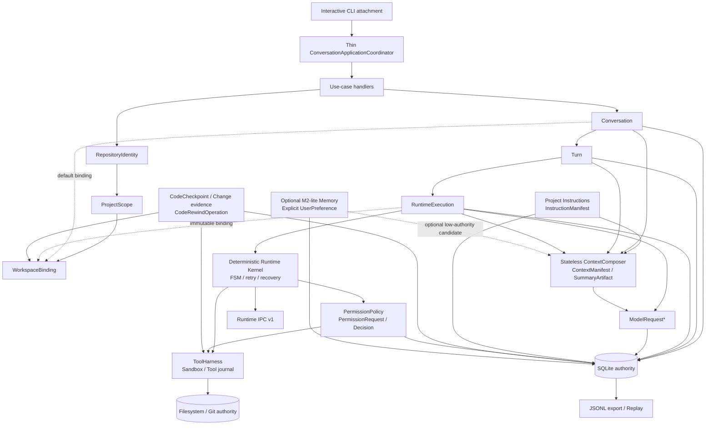

# Target Architecture Snapshot

Date: 2026-09-22
Status: **Architecture frozen; Product-Layer M0 Accepted and complete; M1 Accepted/complete with its additive Product persistence spine implemented; M2–M7 inactive**

## Purpose and authority

This document is the concise target view of the finalized Coding Agent product ADRs. It is a map,
not a replacement for the individual decisions. Current implementation facts remain documented in
[`current-state.md`](./current-state.md) and [`architecture.md`](./architecture.md).

The formal [`M1 execution contract`](./execution-contracts/m1-execution-contract.md) is Accepted and complete.
M1 has implemented its additive Schema v5 Product persistence spine and compatibility mappings;
the legacy Runtime Kernel remains authoritative for existing one-shot execution and M2–M7 remain
inactive.

The product target is a Claude Code-like local Coding Agent with a simple product model above a
reliable, recoverable RuntimeExecution kernel.

## Primary domain spine

The requested spine is:

```text
RepositoryIdentity
    → ProjectScope
    → WorkspaceBinding
    → Conversation
    → Turn
    → RuntimeExecution
    → ModelRequest*
```

The arrows express the binding and decision path, not uniform aggregate ownership:

- RepositoryIdentity is the stable local repository authority; independent clones remain distinct.
- ProjectScope identifies a repository-relative project or monorepo sub-scope.
- WorkspaceBinding identifies one concrete working tree/worktree and observed workspace facts.
- Conversation references RepositoryIdentity, ProjectScope, and a default WorkspaceBinding; it
  does not own the filesystem.
- Turn is one accepted user request, including ordered SteeringInput and UserReply.
- RuntimeExecution is the one recoverable Agent loop for that Turn in V1 and freezes its
  WorkspaceBinding.
- ModelRequest is an immutable, durably committed model input; one RuntimeExecution may create many.

The containment view is therefore:

```text
RepositoryIdentity
├── ProjectScope*
└── WorkspaceBinding*

Conversation
├── repository_identity_id
├── project_scope_id
├── default_workspace_binding_id
└── Turn*
    └── RuntimeExecution (exactly one in V1)
        ├── immutable workspace_binding_id
        └── ModelRequest*
```

## System map



## Product layer

### Interactive attachment

The CLI owns input buffers, dialogs, rendering, selected IDs, and an ephemeral startup draft. It
does not own Conversation, Runtime, workspace, permission, or transcript state. Plain startup
discovers repository/project/workspace/trust/recovery facts and creates no durable Conversation.

### ConversationApplicationCoordinator

The coordinator dispatches use cases and application transactions over versioned authorities. It
has no independent durable state, does not hold writer authority, cannot execute tools, cannot
decide policy, and cannot build a prompt outside the ContextManifest path.

### Conversation and Turn

Conversation is the append-only semantic transcript authority. It survives terminal Turns, CLI
exit, and execution-host loss. V1 allows at most one open Turn per Conversation. Turn status is a
projection of its one RuntimeExecution rather than an independent FSM.

Turn admission logically publishes Conversation when needed, InitialRequest, Turn,
RuntimeExecution, TurnStartCodeCheckpoint, base InstructionManifest, immutable WorkspaceBinding,
and permission-policy epoch. No code side effect precedes checkpoint publication.

## Workspace and code authority

Filesystem and Git are the current code authority. Local interactive mode binds and edits the
user's current working tree by default. Managed worktrees are explicit isolation for parallel,
background, or higher-risk work. Existing per-session copied workspaces remain compatibility and
eval mechanisms until their migration milestones.

That target is delivered behind a staged rollout gate. M2 may establish direct WorkspaceBinding,
Conversation/Turn continuity, and read-only interactive paths, but no product path mutates a real
user working tree until both M3 instruction/context protection and the complete M4 permission,
capability, diff, undo, and recovery acceptance gates pass. The gate includes explicit file writes,
commands and caches, Git inspection side effects, startup/admission artifacts, indirect effects,
and rewind. A placeholder InstructionManifest or checkpoint identity/coverage shell is not the
corresponding protection. Isolated fixtures/copies are exempt from real-tree rollout only, never
from actual ToolHarness, policy, sandbox, journal, or recovery semantics.

Writer authority is acquired and revalidated before coordinated mutations; it is not permanently
owned by a RuntimeExecution. It may release at durable safe waits. A separate recovery barrier
continues to block coordinated writers while an effect remains unknown, even after normal process
or writer leases expire.

## Project Instructions

InstructionSource and InstructionScope belong to repository/project/path/workspace configuration
evidence. Each RuntimeExecution uses an immutable InstructionManifest epoch. Path-specific rules
activate before a controlled write in that scope can execute. Instructions are soft model context
and never grant capability, permission, sandbox access, writer authority, or ToolHarness bypass.

## Context and compaction

Context is a per-ModelRequest projection, not product state. Product authorities provide
Conversation, Turn, instruction, workspace, and summary candidates; RuntimeExecution provides its
causal frontier and active protocol state. Stateless ContextComposer creates a Frozen
ContextPackage and ContextManifest, durably commits the exact ModelRequest, and only then calls the
provider.

Conversation transcript remains authority. SummaryArtifact is derived, range-addressed, sourced,
and stale-sensitive. ToolResultArtifact owns captured output; NormalizedObservation and excerpts
are bounded projections. File content entering context is WorkspaceBinding/path/revision/range
bound and never becomes a second filesystem.

Unknown provider outcome retries the exact persisted ModelRequest with a new attempt. A later new
model decision creates a new ModelRequest and may incorporate validated drift or reconciliation.

## Tool capability, permission, and sandbox

ToolDefinition declares the capability ceiling. A normalized invocation produces resource- and
effect-specific CapabilityClaims. PermissionPolicy returns UNAVAILABLE, ALLOW, ASK, or DENY.
Permission asks whether the user authorizes the action; sandbox and ToolHarness determine whether
the system can enforce it safely.

A ToolInvocation is durably committed before execution. ASK creates a digest-bound
PermissionRequest and typed PermissionDecision. Approval never changes the invocation and never
waives containment, writer, revision, mode, sandbox, or ToolHarness checks. Ordinary text cannot
act as approval.

ToolHarness remains the only gateway for real file/process/external effects. Provider formats stay
inside adapters. Foreground supervised command execution remains the V1 process boundary; no
unmanaged shell background escape is introduced.

## Diff, checkpoint, and undo

The product exposes three distinct views:

- Current Workspace Diff;
- Turn Workspace Delta, which is temporal and not authorship authority; and
- Agent-Controlled ChangeSet, proven by controlled ToolHarness edits.

Command-window changes remain `OBSERVED_COMMAND_DELTA`. Every accepted Turn has a checkpoint with
explicit coverage. Direct-working-tree undo is conditionally strong only when current file state
matches the recorded after state.

`/undo` creates a durable CodeRewindOperation. It is not a Turn, RuntimeExecution, Task, or Git
reset. It acquires writer authority, validates all targets before writing, restores through
ToolHarness, and preserves old Turn/Runtime history.

## Optional Memory

Memory is not on the V1 critical path. V1 requires only an explicitly requested governed
UserPreference. It is lower authority than current user intent, ConversationInstruction,
InstructionManifest, workspace evidence, and enforcement policy. Core Snapshot and generic
automatic top-k injection are OFF. Conversation history search precedes automatic long-term
extraction.

If selected for a ModelRequest, Memory is an optional ContextComposer candidate with explicit
record/version/scope/reason metadata. The core Agent continues when Memory is absent or offline.

## RuntimeExecution kernel

The existing Runtime kernel remains the execution engine beneath the Product layer. Preserve and
adapt rather than replace:

| Existing asset | Target role |
|---|---|
| deterministic FSM and allowed-transition table | RuntimeExecution lifecycle engine |
| SQLite journal | execution and product durable authority after versioned migration |
| atomic event/snapshot/message/model/tool mutation | transaction primitive for Runtime and Turn admission composition |
| Runtime checkpoint | execution continuation only |
| optimistic version and execution lease | single-host execution advancement and recovery fencing |
| model-call journal with normalized request/response | Frozen ModelRequest and attempt foundation |
| tool-call intent/result journal | ToolInvocation recovery and reconciliation foundation |
| interrupt request and stable-boundary transition | recoverable interruption foundation |
| ToolHarness and WorkspaceGuard | sole side-effect gateway and containment foundation |
| sandbox executor and trusted profiles | process/resource enforcement foundation |
| provider adapters | provider-specific wire isolation |
| Context sections, attribution, compression lineage | ContextManifest and SummaryArtifact foundation |
| JSONL export and replay | rebuildable audit projection and semantic regression evidence |
| Runtime IPC v1 | stable existing headless producer protocol |
| Eval harness and semantic goldens | migration characterization and regression gates |

The Product layer may split ownership and add IDs, manifests, events, and use cases. It must not
duplicate the Agent loop, move FSM decisions into the coordinator, bypass ToolHarness, or replace
SQLite with a second state authority.

## Persistence and recovery

SQLite remains the sole local durable authority. Product semantic events and Runtime/tool audit
events have different responsibilities but may commit through shared transaction primitives and
durable sequence rules.

Recovery distinguishes:

- resume Conversation from resume RuntimeExecution;
- execution lease from workspace writer authority;
- writer authority from recovery barrier;
- permission wait from clarification wait and reconciliation wait;
- exact request retry from a new model decision;
- Runtime checkpoint from code checkpoint and Git history; and
- host loss from explicit user cancellation.

JSONL remains a rebuildable export. Runtime IPC v1 remains a public projection rather than a copy
of private SQLite or product schemas.

## Authority table

| Authority | Owns |
|---|---|
| RepositoryIdentity store | stable local repository identity and descriptor relationships |
| Filesystem / Git | current working tree, index, HEAD, refs, and repository state |
| Conversation durable log | ordered semantic transcript, Turns, and product operations |
| Runtime/tool journal | FSM, attempts, calls, retry, permission, recovery, and execution audit |
| InstructionManifest snapshots | applicable instruction epoch for an execution/request |
| ToolResultArtifact | captured tool-result authority subject to explicit completeness |
| CodeCheckpoint/change journal | covered code baseline, controlled mutation evidence, rewind progress |
| Frozen ModelRequest | exact historical model-visible input |
| ContextManifest | why one request included, omitted, or rejected sources |
| SummaryArtifact | derived Conversation compaction cache only |
| Memory store | optional governed preference/history evidence, never current product/code authority |

## V1 boundary

V1 requires the primary domain spine, direct local WorkspaceBinding, one open Turn, one
RuntimeExecution per Turn, durable input/control semantics, instructions, frozen context,
permission, layered diff, controlled undo, resume/recovery, and interactive commands.

The delivery slice is a local single-user Linux host using POSIX process semantics, with a
preprovisioned pure-Python/package workflow on enforceable sandbox capabilities, plus
language-agnostic bounded filesystem operations and read-only Git inspection. The complete
acceptance surface is frozen in
[`v1-development-capability-matrix.md`](./v1-development-capability-matrix.md); it is a future
commitment, not a statement of current implementation.
Python is only the V1-certified command ecosystem, not a domain architecture constraint. The
architecture remains ecosystem-agnostic, so future language/tooling profiles need no domain-model
redesign; they still require separate activation, enforceable trust/policy configuration, and
acceptance evidence and receive no automatic approval.

V1 does not require persistent Task, daemon/background host, managed process resources, automatic
Memory extraction, Core Snapshot, Dynamic Recall, Skills, MCP, multi-Agent coordination, vector
stores, or a second Runtime implementation. It also excludes background/long-running process
management as a durable product resource, Conversation rewind, joint code-and-Conversation rewind,
unrestricted arbitrary shell, macOS/Windows support, and automatic provisioning/certification of
non-Python ecosystems or native toolchains. Bounded foreground tools may still run for a long time
under supervision. The ADR-reserved explicit shell form remains deferred rather than removed from
the domain model.
